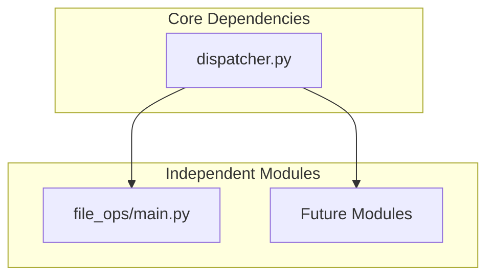

# Module Dependency Map

## Current Structure

### Core Components


## Module Independence vs. Shared Functionality

### What Should Stay Independent
1. Business Logic
   - Each module handles its own specific tasks
   - No cross-module business rules
   - Individual error handling

2. State Management
   - Each module manages its own state
   - No shared state between modules
   - Independent data storage

3. Configuration
   - Module-specific settings
   - Individual initialization
   - Separate logging

### What Can Be Shared
1. Common Utilities
   - Type definitions
   - Basic helpers
   - Logging format

2. Communication Protocol
   - Message structure
   - Response formats
   - Error formats

## Development Strategy

### Phase 1: Core Framework
- Dispatcher (minimal)
- Basic message types
- Simple utilities

### Phase 2: Essential Modules
Each module should be:
- Self-contained
- Minimal dependencies
- Clear interface

### Phase 3: Integration
- Light message passing
- No complex dependencies
- Easy to test

## File Organization
```
personal_assistant/
├── modules/
│   ├── core/
│   │   ├── dispatcher.py     [Routes messages]
│   │   └── types.py         [Shared types]
│   └── features/
│       └── file_ops/        [Independent module]
├── utils/
│   └── common.py            [Shared utilities]
└── config/
    └── settings.py          [Global settings]
```

## Best Practices
1. Keep modules isolated
2. Share only essential types
3. Minimize cross-module dependencies
4. Document all connections
5. Test modules independently

## Questions Before Each Module
1. Is this truly independent?
2. Can it work standalone?
3. Are we duplicating code?
4. Is the interface minimal?
5. How will it scale?

## Development Checklist
- [ ] Define module interface
- [ ] Document dependencies
- [ ] Create tests first
- [ ] Implement core functionality
- [ ] Validate independence
- [ ] Review memory usage
- [ ] Check context impact
